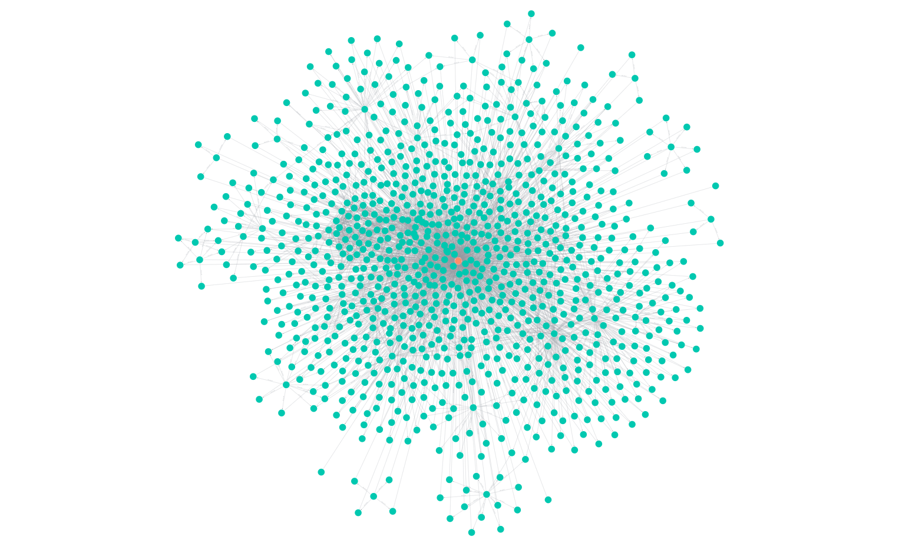

# CSV2FAIR_KG

**CSV2FAIR_KG** transforms tabular data (CSV) into a Findable, Accessible, Interoperable and Reusable (FAIR) knowledge graph (KG) for biomedical research. It integrates ontology mapping, metadata enrichment, Persistent Identifier (PID) assignment and graph construction for semantic applications.



## Environment Setup (Linux)

```bash
python3 -m venv venv-tab2g
source venv-tab2g/bin/activate
pip install --upgrade pip
pip install -r requirements.txt
python3 -m textblob.download_corpora
```

## Data
- Install converter (e.g., ssconvert from Gnumeric)
  - MAC: `brew install gnumeric`
  - Linux: `sudo apt install gnumeric`
- Download dataset (.xlsx file) from (GEO)[https://www.ncbi.nlm.nih.gov/geo/query/acc.cgi?acc=GSE280797]
- Download .soft file (Soft formatted family file(s)) from GEO page and extract file
- Convert .xlsx to .csv file: `ssconvert GSE280797_Processed_data.xlsx GSE280797_Processed_data.csv`
- Move GSE280797_Processed_data.csv into folder `data/hepatic/csv_data/`
- Move GSE280797_family.soft into folder `data/hepatic/metadata_PEP/`
- Delete first 40 rows (until CSV header) of .csv file
- Crop first 81 rows of .csv file for experiments

## Requirements and Access
To use this pipeline, ensure you have:

- Azure OpenAI API access (for LLM-based enrichment)
- BioOntology API access (for ontology annotation)
- Neo4j Desktop or Aura (free version) for graph storage and visualization
- Zenodo Sandbox access

Create a `.env` file by copying and editing the provided `.env_dummy` file:

```bash
cp .env_dummy .env
# Then edit .env with your credentials
```

## Configuration

Edit settings in `config/config.py`:

```python
DEPLOYMENT_NAME = "YOUR_MODEL_NAME"      # Set the deployed model name
FAIR_GRAPH = True                        # Set to False for baseline (non-fair) GraphRAG
ENTITY_CLASS_LIST = ["pathway", "GO-BP"] # Define biomedical entity classes, set to "pathway" and "GO-BP" to reproduce experiments
```

## Running the Pipeline
Execute the main script:

```bash
python3 main.py
```

After execution, visualize the generated graph in Neo4j Desktop or Aura.

## Data Structure
This project is optimized for Gene Expression Omnibus (GEO) Series data:

- CSV tables:  
  `data/hepatic/GSE.../csv_data/`

- Metadata (PEP):  
  `data/hepatic/GSE.../metadata_PEP/`  
  (expects `.soft` file)


## Citation

If you use **CSV2FAIR_KG** in your research or application, please cite the following:

> Flüh, M. (2025). *FAIR GraphRAG: A Retrieval-Augmented Generation Approach for Semantic Data Analysis*.

A formal citation file is included as [`CITATION.cff`](CITATION.cff) for automated reference managers and repositories.

## License

This project is licensed under the [MIT License](LICENSE). You are free to use, modify, and distribute this software with attribution.

## Project Metadata

- **Title:** CSV2FAIR_KG  
- **Description:** A pipeline for converting biomedical tabular data into FAIR-compliant knowledge graphs using methods for FAIRification and graph construction.  
- **Keywords:** FAIR Principles, knowledge graph construction, large language model  
- **Authors:**  Marlena Flüh
- **Repository:** https://github.com/FAIR-GraphRAG/CSV2FAIR_KG
- **License:** MIT
